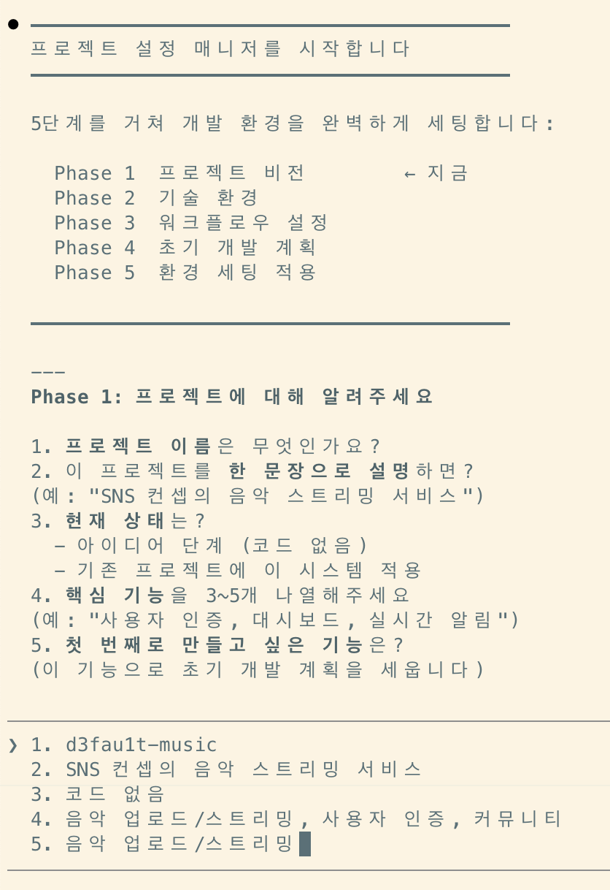
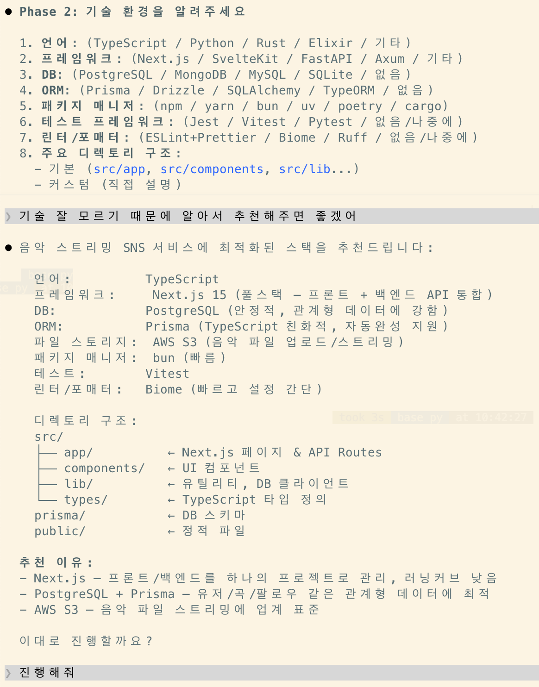
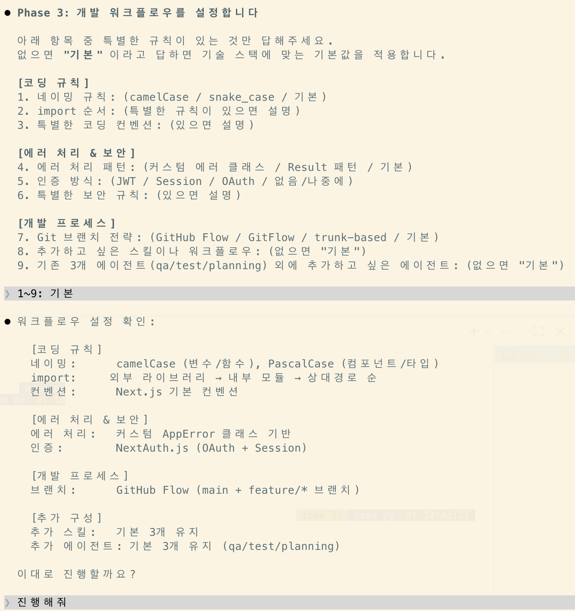
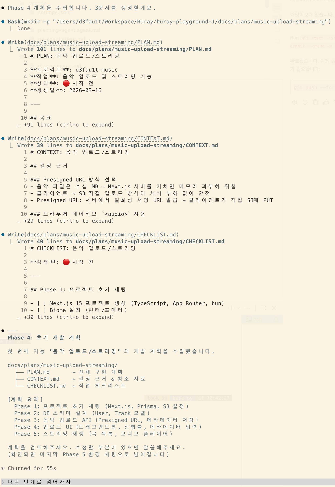
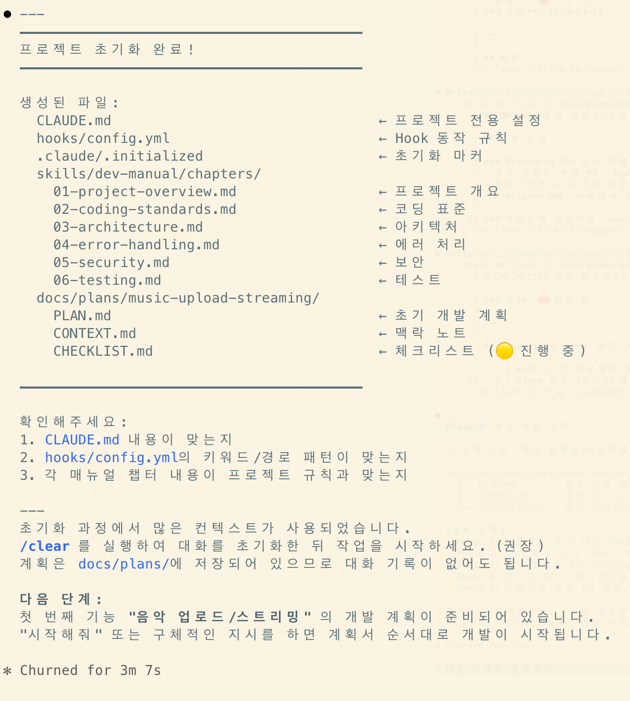

# HELPER

`/setup` 커맨드를 오버라이드합니다.

프로젝트 설정, 기술스택, 기획 등을 러프하게 정하고 바로 시작해볼 수 있습니다.

## Phase 1

개략적인 기획, 개발방향을 정하는 단계입니다.

## Phase 2

기술 스택을 정하는 단계입니다.

잘 모른다면 일단 추천받아서 시작해볼 수 있습니다.

## Phase 3

코드 컨벤션, 에러 핸들링, 기타 개발관련 프로세스를 정하는 단계입니다.

잘 모른다면 기본설정으로 진행해볼 수 있습니다.

## Phase 4

입력했던 사항으로 `docs/plans` 에 관련 문서가 생성됩니다.

## Phase 5

프로젝트 작업에 필요한 초기 설정이 완료되었습니다.

이제 작업 진행상황을 지켜보면서 자연어로 요구사항을 주고받으면 됩니다.
